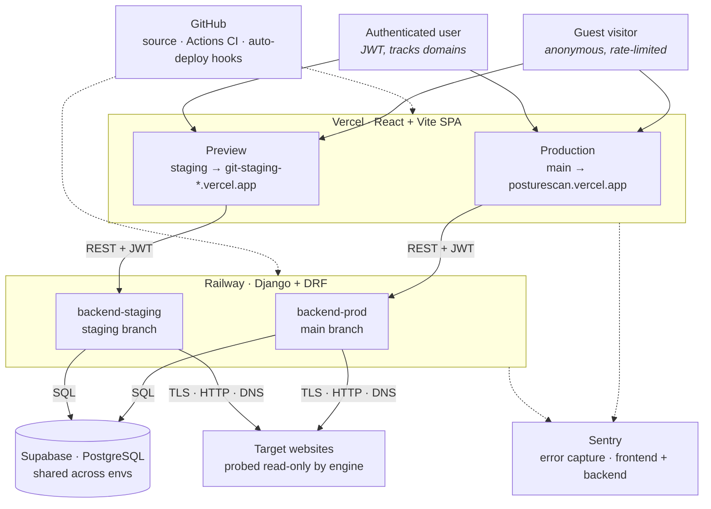

# PostureScan

> Grade any domain's external security in seconds. TLS, HTTP headers, cookies, DNS — twenty-plus checks, one report.

**Live**  ·  [posturescan.vercel.app](https://posturescan.vercel.app)  
**Source**  ·  [github.com/MDPorsch/posturescan](https://github.com/MDPorsch/posturescan)  
**Team**  ·  [posturescan.vercel.app/team](https://posturescan.vercel.app/team)

---

PostureScan is a free web application that scans any public domain and returns a graded report of its external security posture. It runs over twenty independent checks across eight categories — TLS configuration, HTTP response headers, cookie flags, DNS health, redirect safety, mixed-content scanning, and HTTP protocol version — and assigns each finding a pass, warning, or fail with a specific copy-paste remediation.

Unlike enterprise security tooling that requires installation, configuration, or account creation, PostureScan is usable directly from a browser with zero friction. Type a hostname, wait about ten seconds, and read the report. Authenticated users can additionally track domains over time, compare scans, and download PDF reports.

The product was built as a Cloud & DevOps capstone project by nine team members from the TechCrush cohort.

## What it does

- **Eight check categories, twenty-plus individual checks** covering TLS certificates and configuration, HSTS, CSP, X-Frame-Options, X-Content-Type-Options, Referrer-Policy, Permissions-Policy, cookie flags (Secure, HttpOnly, SameSite), redirect chain analysis, mixed-content detection, SPF / DMARC / CAA records, and HTTP version negotiation.
- **A–F grades** computed from weighted check results, plus a clear breakdown by category.
- **Concrete remediation for every failure** — not links to documentation, the configuration line itself.
- **Guest scanning, no signup required** for the core flow.
- **Authenticated accounts** add domain tracking, scan history, score-over-time charts, scan-to-scan comparison, and PDF report downloads.
- **Public dashboard** showing aggregate statistics, grade distribution, common failure modes, and recent activity (with privacy-aware hostname masking).
- **No tracking pixels, no ad networks, no third-party analytics scripts.** The [privacy page](https://posturescan.vercel.app/privacy) lists every claim plainly.

## Architecture

PostureScan is organised into four layers (users, frontend, backend, data) with two cross-cutting sidecars (source/CI and error monitoring). Staging and production are parallel environments on the same infrastructure providers, sharing a single managed database.



A full architecture write-up, including component breakdown and the three workflows (guest scan, authenticated scan, continuous deployment), is in [`docs/architecture.md`](docs/architecture.md).

## Tech stack

| Layer | Technology |
|-------|------------|
| **Frontend** | React 18, Vite, Tailwind CSS, React Router, Recharts |
| **Backend** | Django 5, Django REST Framework, SimpleJWT, psycopg v3, gunicorn |
| **Database** | PostgreSQL (managed by Supabase) |
| **Hosting** | Vercel (frontend), Railway (backend) |
| **CI / CD** | GitHub Actions, Railway + Vercel native GitHub integration |
| **Monitoring** | Sentry (frontend and backend, environment-tagged) |
| **Development** | Python 3.13, Node 20, pytest, ESLint |

## Getting started

### Prerequisites

- Python 3.13+
- Node 20+
- A PostgreSQL database (a local one is fine for development; we use Supabase in production)

### Backend

```bash
cd backend
python -m venv .venv
source .venv/bin/activate
pip install -r requirements.txt

# Copy the example env and fill in your values
cp .env.example .env

# Apply database migrations
python manage.py migrate

# Run the dev server
python manage.py runserver
```

Backend defaults to `http://localhost:8000`.

### Frontend

```bash
cd frontend
npm install

# Copy the example env and fill in your values
cp .env.example .env

# Run the dev server
npm run dev
```

Frontend defaults to `http://localhost:5173` and expects `VITE_API_BASE_URL` to point at your local backend.

### Environment variables

**Backend** (`backend/.env`)

| Variable | Purpose |
|----------|---------|
| `DJANGO_SETTINGS_MODULE` | `scanner.settings.dev` locally, `scanner.settings.staging` or `scanner.settings.prod` in deploy |
| `SECRET_KEY` | Django secret key (random 50-char string) |
| `DATABASE_URL` | Postgres connection string |
| `CORS_ALLOWED_ORIGINS` | Comma-separated list of allowed frontend origins |
| `CORS_ALLOWED_ORIGIN_REGEXES` | Regex patterns for dynamic origins (e.g. Vercel previews) |
| `SENTRY_DSN` | Optional; backend Sentry DSN |
| `SENTRY_ENVIRONMENT` | `development` / `staging` / `production` |

**Frontend** (`frontend/.env`)

| Variable | Purpose |
|----------|---------|
| `VITE_API_BASE_URL` | URL of the backend API |
| `VITE_SENTRY_DSN` | Optional; frontend Sentry DSN |
| `VITE_SENTRY_ENVIRONMENT` | `development` / `staging` / `production` |

### Running tests

```bash
# Backend tests
cd backend && pytest

# Frontend lint
cd frontend && npm run lint

# Frontend build (sanity check)
cd frontend && npm run build
```

## Project structure

```
posturescan/
├── backend/                    # Django + DRF backend
│   ├── apps/
│   │   ├── accounts/           # Custom user, JWT auth
│   │   ├── domains/            # User-owned domains, ownership verification
│   │   ├── scans/              # Authenticated scans, PDF export, comparison
│   │   ├── public/             # Guest mode, public dashboard, badges
│   │   └── engine/             # Scan engine, SSRF guard
│   ├── scanner/                # Django project settings
│   │   └── settings/
│   │       ├── base.py
│   │       ├── dev.py
│   │       ├── staging.py
│   │       └── prod.py
│   ├── tests/                  # Backend tests
│   ├── manage.py
│   ├── railway.json            # Railway build / pre-deploy config
│   ├── Procfile
│   └── requirements.txt
│
├── frontend/                   # React + Vite frontend
│   ├── src/
│   │   ├── api/                # API client (REST, JWT handling)
│   │   ├── components/         # Reusable UI components
│   │   ├── hooks/              # Auth context, etc.
│   │   ├── pages/              # Route-level page components
│   │   ├── App.jsx
│   │   └── main.jsx
│   ├── index.html
│   ├── tailwind.config.js
│   ├── vite.config.js
│   ├── vercel.json             # SPA fallback rewrite
│   └── package.json
│
├── docs/                       # Project documentation
│   ├── architecture.md         # Full architecture write-up
│   └── architecture.svg        # Architecture diagram
│
├── .github/
│   └── workflows/
│       └── ci-cd.yml           # Test backend + test frontend
│
└── README.md
```

## Deployment

Both frontend and backend deploy automatically from GitHub when a commit lands on the relevant branch.

```
staging branch ──→ backend-staging (Railway) + posturescan-git-staging-*.vercel.app
   main branch ──→ backend-prod    (Railway) + posturescan.vercel.app
```

Each push triggers GitHub Actions to run backend and frontend tests. Railway's "Wait for CI" feature holds the deploy until checks pass. Migrations and static collection run via `railway.json`'s `preDeployCommand` before the new release takes traffic. Vercel builds in parallel and serves the new frontend the moment its build completes.

**Promote from staging to main**

```bash
git checkout main
git merge --ff-only staging
git push origin main
git checkout staging
```

The `--ff-only` flag guarantees `main` is always a strict ancestor of `staging`. Direct commits to `main` are not allowed — this rule prevents the divergence problems we ran into early on.

## The team

| Name | Role |
|------|------|
| Mohammed Orunsolu | Lead Engineer |
| Aishat Igbinadalor | DevOps |
| Jimoh Kabiru Adinoyi | Cloud Computing |
| Ogidi Ifunanya Linda | Cloud Computing |
| Jeffrey Umulor | Cloud Engineering |
| Abuachi Uzoma Mc-David | Cloud Engineering |
| Akah Hilary Erunke | Networking & Security |
| Olubiyi Blessed | Software Engineering |
| Wisdom Ayonitemi | Cloud Computing |

Read more on [the team page](https://posturescan.vercel.app/team).

## Acknowledgments

Built across disciplines by the TechCrush Cloud Computing cohort 6. Decisions like guest scanning, hostname masking, and the SSRF guard came from conversations the team kept having until something defensible emerged. The thanks go to everyone who pushed back on a default, suggested a cut, and tested the rough edges before anyone outside the team saw them.

---

*PostureScan is a student capstone project. The source is here so it can be inspected, learned from, and improved on. Issues and suggestions are welcome via [GitHub Issues](https://github.com/MDPorsch/posturescan/issues).*
