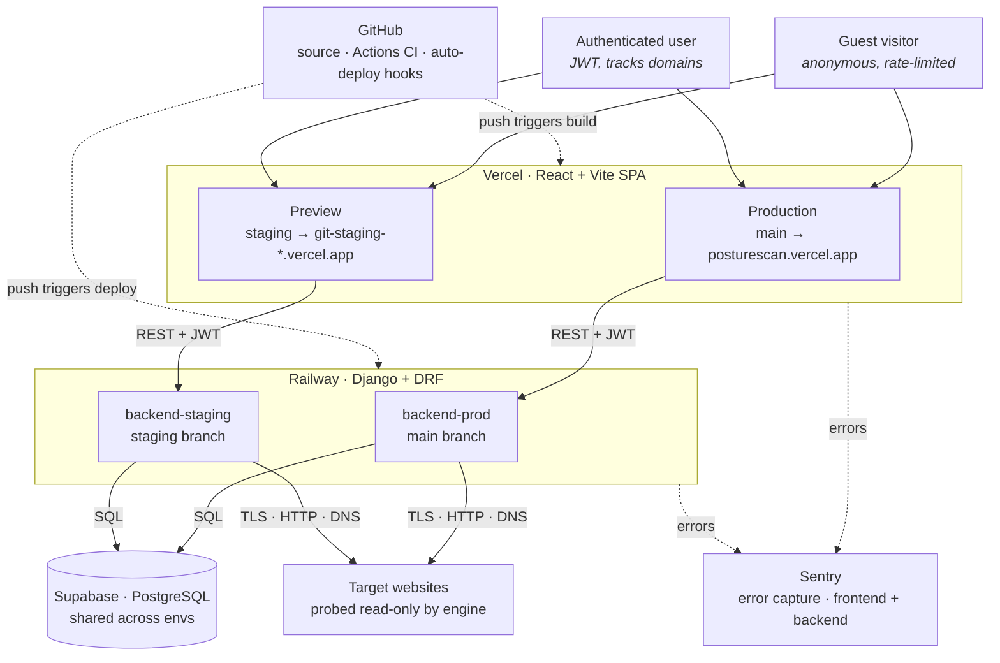

# PostureScan — Architecture

## System overview

PostureScan is split into four layers (frontend, backend, data, scan targets) with two cross-cutting sidecars (source control / CI, error monitoring). Staging and production are deployed as parallel environments on the same infrastructure providers, sharing a single managed database for capstone simplicity.

## Components

**Frontend (Vercel · React + Vite + Tailwind):** Single-page application. Two simultaneous deployments — `posturescan.vercel.app` from the `main` branch (production), and per-commit preview URLs from the `staging` branch. Environment-scoped `VITE_API_BASE_URL` routes the SPA to the matching backend.

**Backend (Railway · Django + DRF):** Two services, `backend-prod` and `backend-staging`, tracking `main` and `staging` respectively. Each runs the same Django app with environment-specific settings (`scanner.settings.prod` vs `scanner.settings.staging`). Pre-deploy hook runs migrations and static collection against Supabase before each new release replaces the old one. Apps inside the Django project:

- `accounts` — custom User model on email, JWT authentication via SimpleJWT
- `domains` — user-owned domain records, ownership verification via DNS TXT
- `scans` — authenticated scans tied to domains, PDF export, scan comparison
- `public` — guest-mode scanning, public dashboard, embeddable badges, shared report tokens
- `engine` — the scan engine itself (TLS, HTTP headers, cookies, DNS, redirects, mixed content) with an SSRF guard that blocks private IPs and localhost

**Database (Supabase · PostgreSQL):** Single managed Postgres instance shared by staging and production. Stores users, domains, scans, check results, and their guest equivalents. The shared database is a capstone simplification — at production scale these would be separate instances.

**Scan targets:** Arbitrary public websites probed read-only by the engine. The SSRF guard ensures the engine cannot be tricked into scanning internal-network addresses or the loopback interface.

**Sidecars:**

- **GitHub:** Source of truth. GitHub Actions runs `test-backend` and `test-frontend` jobs on every push; Railway and Vercel both watch the repo and auto-deploy when CI passes.
- **Sentry:** Two projects (`posturescan-frontend` and `posturescan-backend`). Both production and staging report into the same projects, distinguished by an `environment` tag.

## Workflows

### Guest scan

1. Visitor types a hostname on the landing page and submits.
2. Frontend POSTs to `/api/public/scan/`.
3. Backend validates the hostname through the SSRF guard (rejects private addresses).
4. A `GuestScan` row is created with `status="running"`.
5. The scan engine executes synchronously, running each check category in sequence and writing a `GuestCheckResult` for each finding.
6. Engine computes a 0–100 score and an A–F grade, then marks the scan complete.
7. Backend returns the serialized scan with all results.
8. Frontend renders the graded report; if the hostname is allowlisted, it appears in the public dashboard's featured benchmarks.

### Authenticated scan

1. User signs up via `POST /api/auth/register/` or signs in via `POST /api/auth/login/`. Backend returns JWT access + refresh tokens.
2. Frontend stores tokens in `localStorage`, attaches `Authorization: Bearer …` to every authenticated request.
3. User adds a domain via `POST /api/domains/`. Optionally verifies ownership by adding a DNS TXT record and calling `POST /api/domains/:id/verify/`.
4. User starts a scan via `POST /api/domains/:id/scan/`. Same engine, results stored as `Scan` + `CheckResult` tied to the domain.
5. User views scan history with a score-over-time chart on `/app/domains/:id`, compares any two scans on the report page, and downloads a PDF report.

### Continuous deployment

1. Developer pushes to `staging`. GitHub Actions runs CI.
2. Railway's `backend-staging` service sees the push, waits for CI to pass, then runs the pre-deploy hook (`migrate && collectstatic`), then deploys.
3. Vercel sees the push, builds a preview deployment using the Preview environment variables.
4. Developer verifies on the preview URL.
5. Developer fast-forwards `main` to match `staging` and pushes.
6. Same flow runs on the `main` branch — Railway `backend-prod` and Vercel production both redeploy.

## Notable design decisions

**Synchronous scans, no job queue.** The engine completes a scan in roughly ten seconds — within an HTTP request lifetime. Avoiding Redis/Celery removed an entire deployment dimension and made the local dev story trivial.

**Hostname masking in public output.** Scans of allowlisted public sites (GitHub, Stripe, Cloudflare, etc.) appear in full on the dashboard. Everyone else's scans appear masked (`ex***.com`) to protect users who scan internal or personal infrastructure.

**Pre-deploy migrations via `railway.json`.** Railway's Nixpacks builder doesn't honor Heroku-style Procfile `release:` lines. Migrations are run explicitly via `railway.json`'s `preDeployCommand` so every deployment guarantees the schema is current before the new release takes traffic.

**Branch flow: staging → main fast-forward only.** Development happens on `staging`. The `main` branch is updated only by fast-forwarding to staging — never directly committed to. This guarantees `main` is always a strict ancestor of `staging`, so promotions never produce merge commits or divergence.
